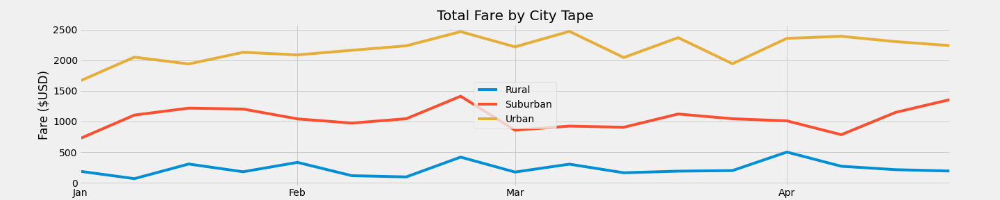

# PyBer_Analysis.
In the past seven years, thanks to Uber and others, not only have new ways to get around the city, but also the corresponding terminology. Now we use not only taxis, but also ***“ridesharing”***. The distinction between the two terms has blurred and are often interchanged with each other. However, there are significant differences between ***ridesharing*** companies and taxi services.

## What is ***"ridesharing"***
___
The essence of ridesharing is that you can share a ride with another passenger. Some fans of such a service claim that they use it not only to save money on fuel, but for the sake of  **"a social mission - protecting the environment and improving mobility."**

##   __The purpose of the new analysis__
___
The purpose of our analysis should be data on which it will be possible to navigate in which types of cities ridesharing is more developed, where it is more in demand, where more people are involved in this type of activity. Based on this, it will be clear where the new ridesharing application will work with more efficiency!
First, we will calculate the averages and totals for the three types of cities to start the analysis:

+ *__The total number of rides for each city type.__*
+ *__The total number of drivers for each city type.__*
+ *__The total fares for each city type.__*
+ *__The average fare per ride for each city type.__*

## Results and Conclusions
___
- [x] In the first table, we see the total number of trips, how many drivers were involved - the total cost, as well as the average fare per trip and the average fare per driver by city type.

- [x] In the second table, we show the budget for trips in different types of cities for a certain period - a week.
We convey the same information in the chart below, only using a more accessible view - breaking the step into
x-axis by month.

- [x] We convey the same information in the chart below, only using a more accessible view - breaking the step into
x-axis by month.

___
# **Summary**
**Based on our results, we can say with confidence that in big cities ridesharing has taken the lead among people who are not against additional earnings, but who also want to save money on a trip - that's enough! But the suburbs have not gone so far, there is an unequivocal potential in it. Things are more difficult in the rural. To implement a ridesharing application, one can definitely consider big cities where there is more demand, but the suburban is also growing. Considering that there is now a general struggle for the environment, especially in big cities, ridesharing remains on top compared to taxis - this has already been proven by sociologists. For a more confident conclusion on the suburbs and the rural, I would advise taking another analysis of the data to calculate how many users use ridesharing applications in these areas in relation to the total number of people living in them. Hope for further cooperation!**